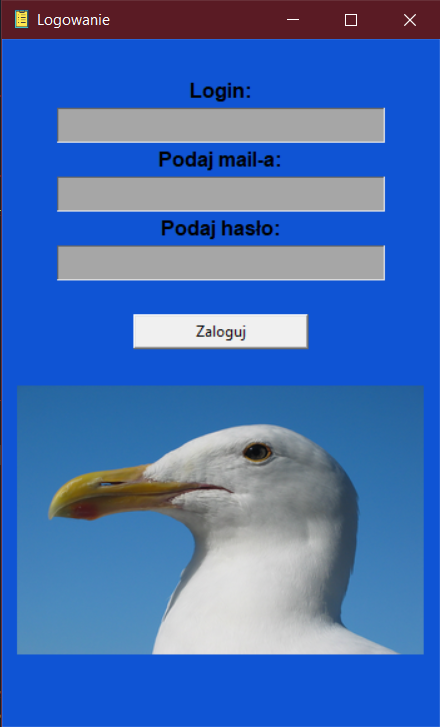
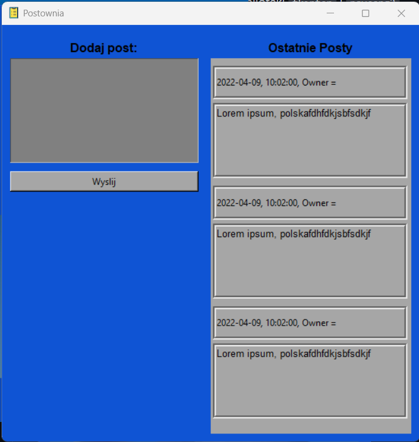

<h2>POST-APLICATION-WITH-DB</h2>

Aplikacja służy do zalogowania się

Do stworzenia aplikacji zostały użyte biblioteki <code>tkinter</code> i <code>psycopg2</code>

Aplikacja jest w wersji beta i jest podczas rozwoju

